# skyeye

#### 项目介绍

智能制造云办公软件，后端采用Springboot框架，前端采用基于layui封装的winUI，打造一款不同风格的办公软件。适用于中型企业等机构的管理。包含30多个应用模块、50多种电子流程，CRM客户、PM项目、ERP采购、库存、ADM行政、HR人事、笔记、知识库、多门店、商城、财务、考勤、HCM薪资、云盘等全面管理，打造全业务覆盖、全流程驱动的云办公。实现一体化智能制造行业的管理，实现管理流程“客户关系->
线上/线下报价->销售报价->销售合同->生产计划->产品设计->采购->加工制造->入库->发货->售后服务”的高效运作，同时实现企业员工的管理以及内部运作的流程操作，完善了员工从“入职->培训->转正->办公->离职”等多项功能。

- 最新资讯：[2022-10-04 智能制造云办公 v3.8.3 发布，ERP、工作流 更新](https://www.oschina.net/news/212530/skyeye-3-8-3-released)
- [软件更新资讯](https://gitee.com/doc_wei01/skyeye/blob/company_server/HISTORY_UPDATE.md)
- 开源版请下载`master`分支
- [企业版信息](https://docs.qq.com/doc/DQlRxcVRMWWVjbU1i?_from=1&disableReturnList=1)
- 作者本人承诺，知识星球人数达到1000人，即开放所有功能模块源代码(仅供星球内部成员使用)
- 免费体验账号，联系作者填写信息后申请
- 个人软件，无发票

### 联系作者

| 作者微信(备注：姓名-联系方式，其余概不通过。) | 知识星球(可获取企业版所有功能) | 软件咨询(备注：姓名-联系方式，其余概不通过。) | QQ群                        |
|--------------------------| ---- | ---- |----------------------------|
|      |  ||  |

#### 功能矩阵

系统后台集成了主流的通用功能，如：登录验证、系统配置、角色权限、组织管理、功能菜单、模块管理、数据字典、审批流程、员工管理、消息通知、企业公告、知识文章、办公审批、日常办公、财务管理、API接口等。可以基于当前系统的企业版便捷做二次开发。

#### 技术选型

##### 后端技术:

|技术|名称| 官网                                                       |
|---|---|----------------------------------------------------------|
|SpringBoot|核心框架| http://spring.io/projects/spring-boot                    |
|MyBatis|ORM框架| http://www.mybatis.org/mybatis-3/zh/index.html           |
|Druid|数据库连接池| https://github.com/alibaba/druid                         |
|Maven|项目构建管理| http://maven.apache.org/                                 |
|redis|key-value存储系统| https://redis.io/                                        |
|webSocket|浏览器与服务器全双工(full-duplex)通信| http://www.runoob.com/html/html5-websocket.html          |
|Flowable|工作流引擎| https://www.flowable.com/open-source/                    |
|xxl-job|定时任务| https://gitee.com/xuxueli0323/xxl-job?_from=gitee_search/ |
|RocketMQ|消息队列| https://rocketmq.apache.org/dowloading/releases/         |
|solr|企业级搜索应用服务器| https://lucene.apache.org/solr/                          |
|Spring Cloud|微服务框架(目前用户APP端接口)| https://springcloud.cc/                                  |

##### 前端技术：

|技术|名称| 官网                                       |
|---|---|------------------------------------------|
|layui|模块化前端UI| https://www.layui.com/                   |
|winui|win10风格UI| https://gitee.com/doc_wei01_admin/skyeye |

#### 效果图

| 效果图                                    | 效果图                                |
|----------------------------------------|------------------------------------|
| 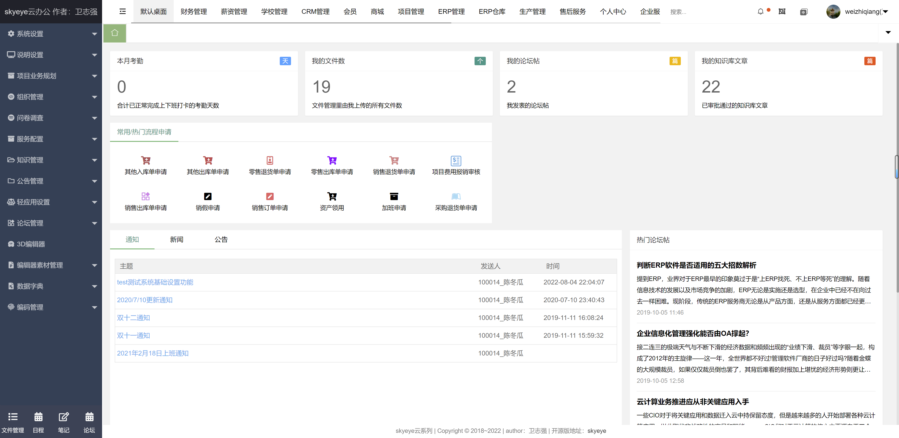 | 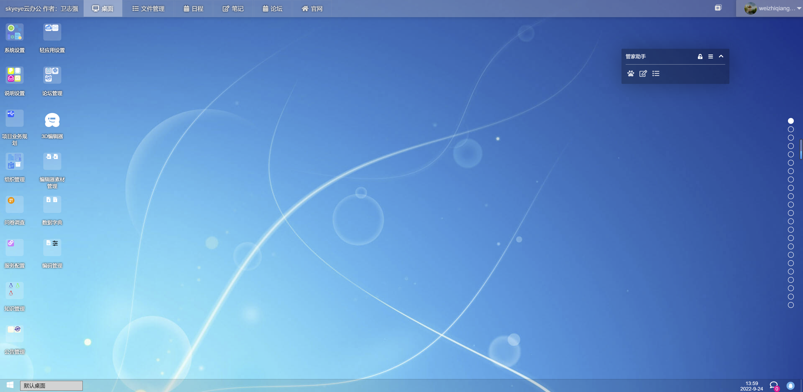 |
| 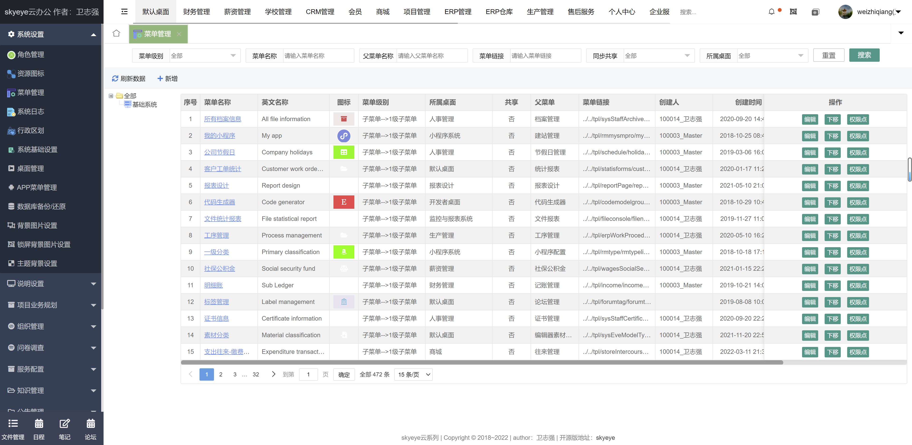 | 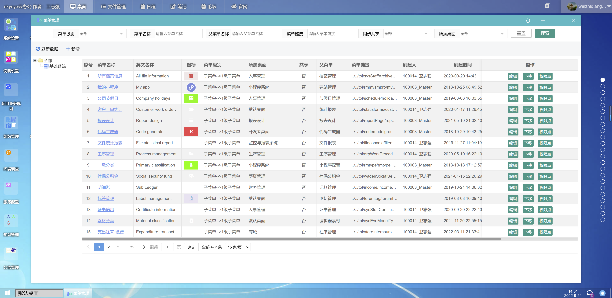 |
| 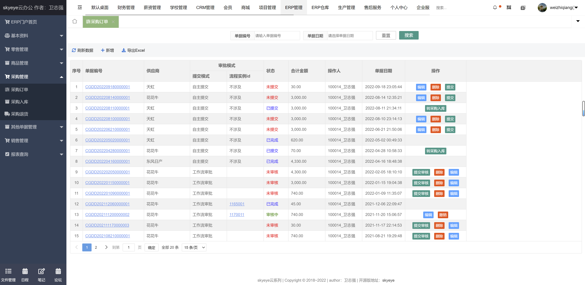 | 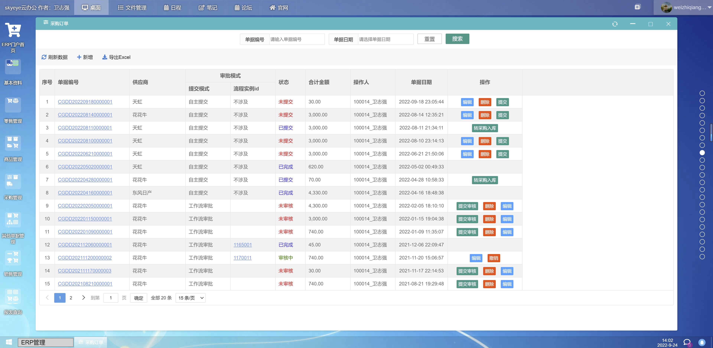 |
| 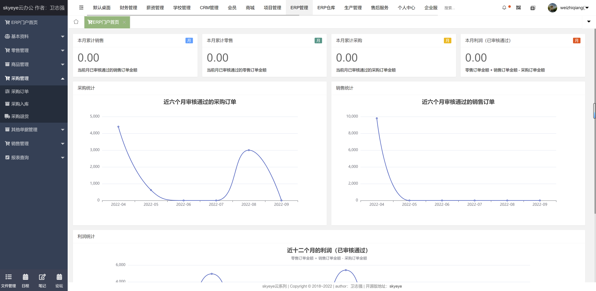 | 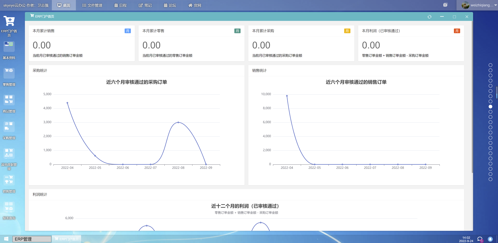 |
| 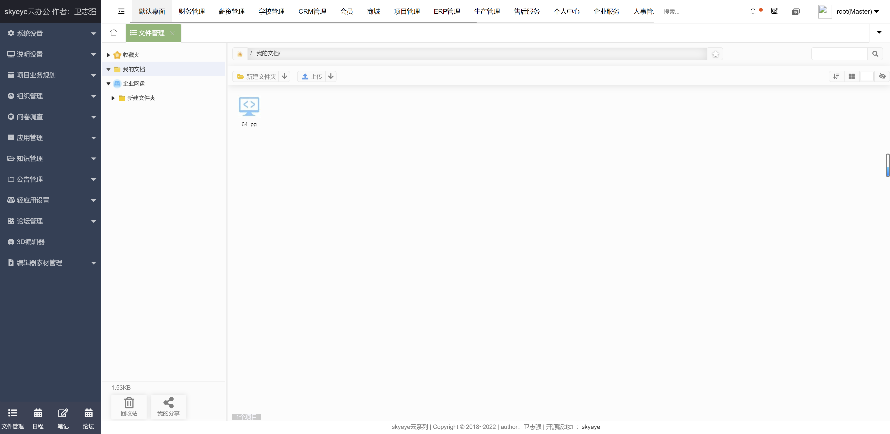 |  |
| 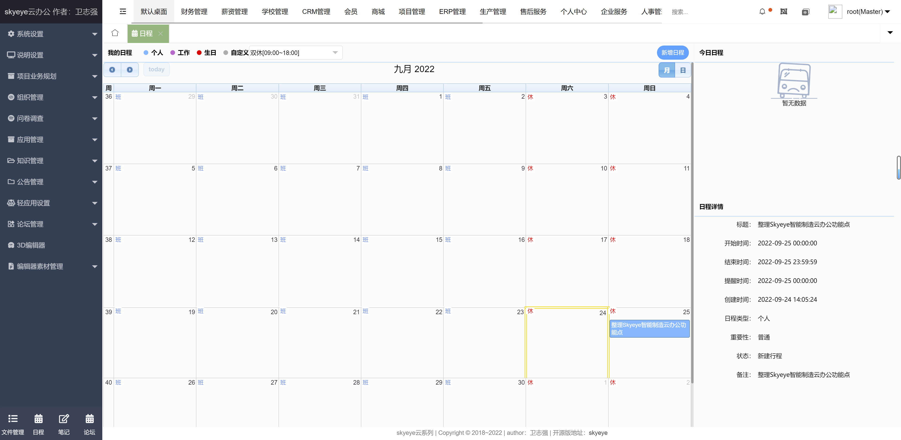 | 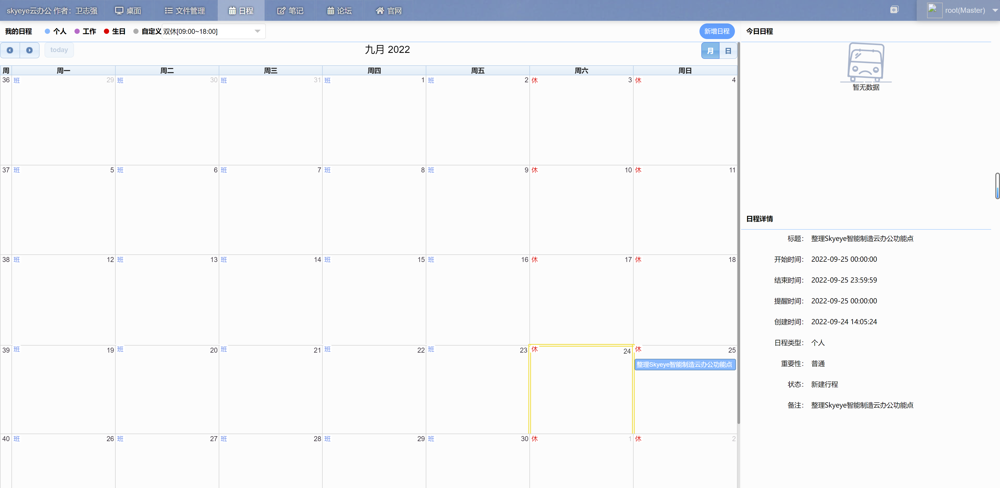 |
| 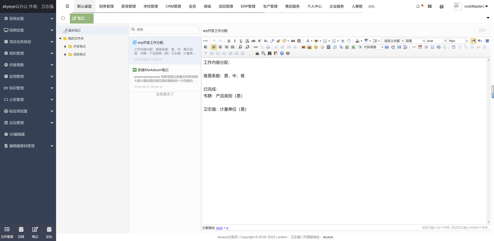 | 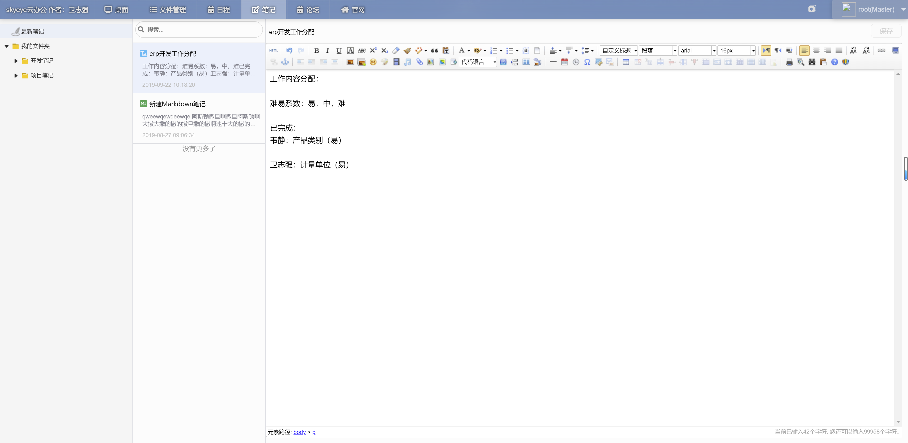 |
| 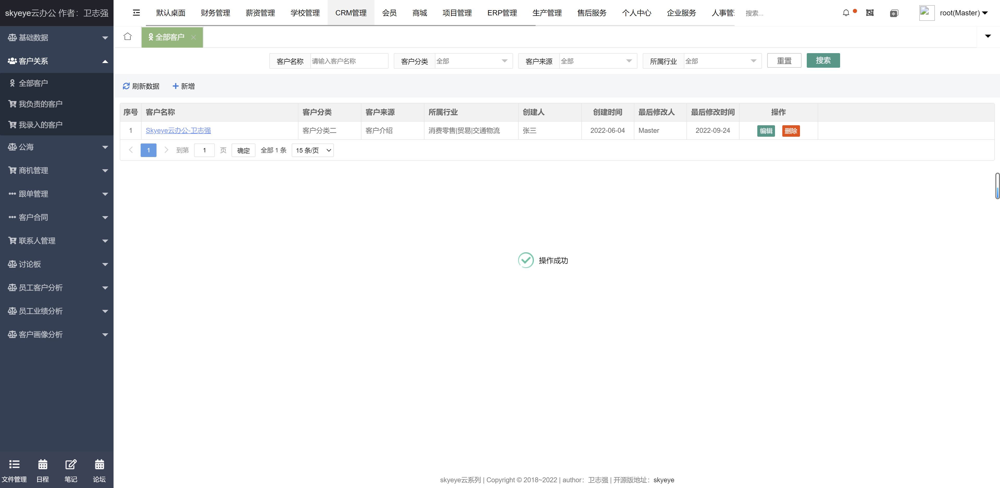 | 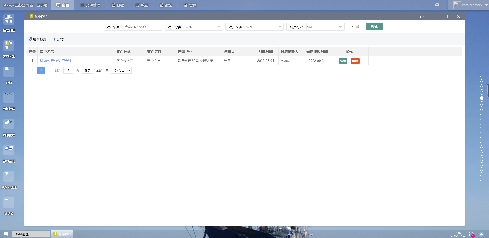 |
| 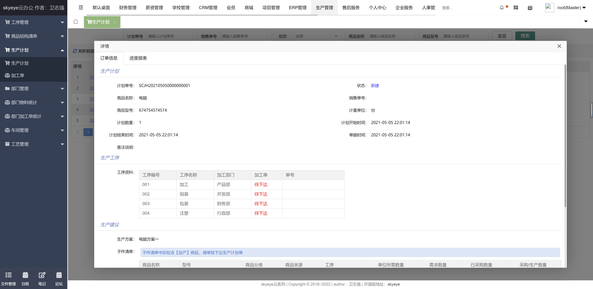 | 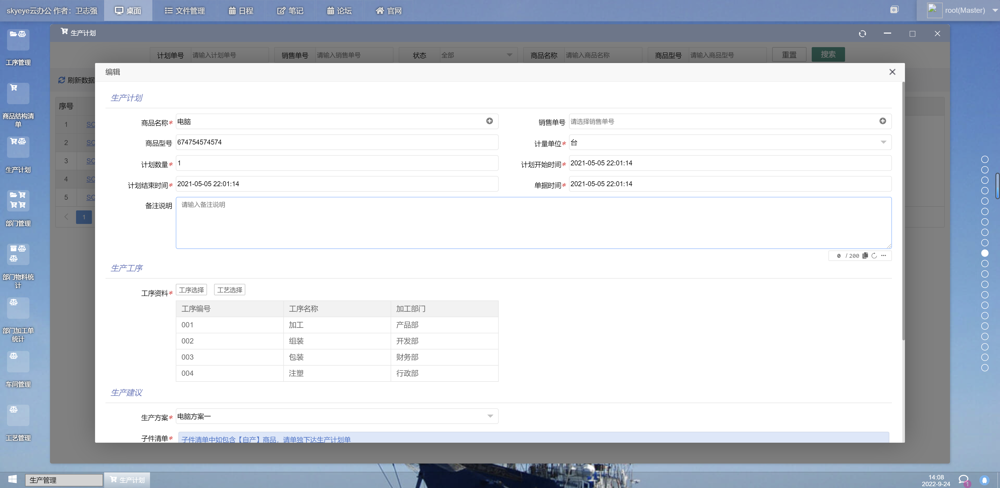 |
| 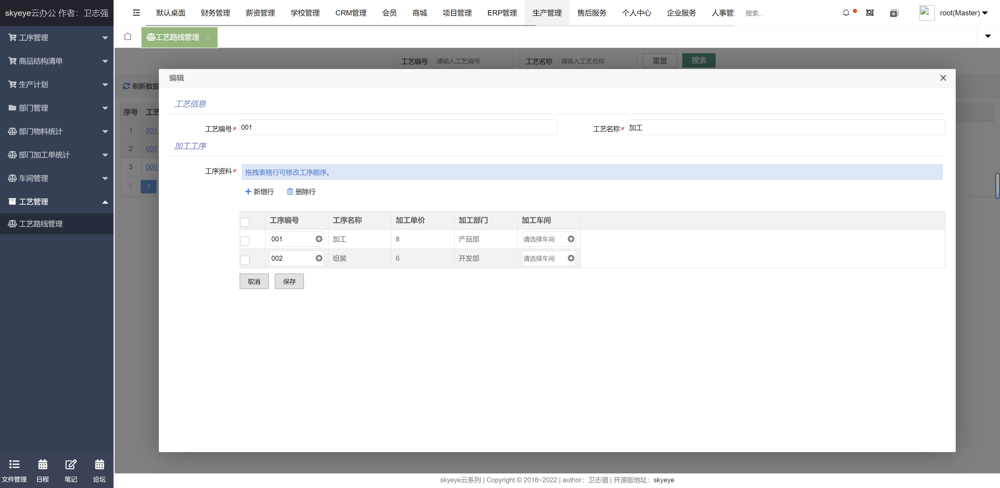 | 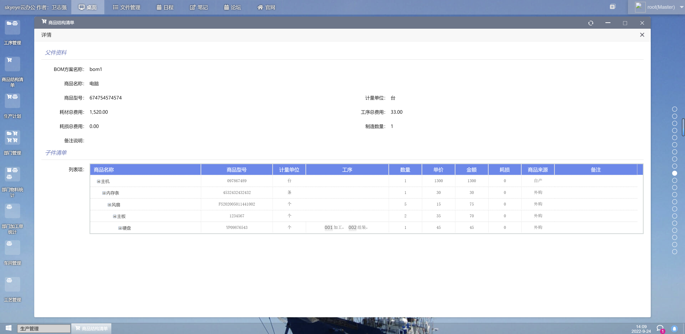 |

