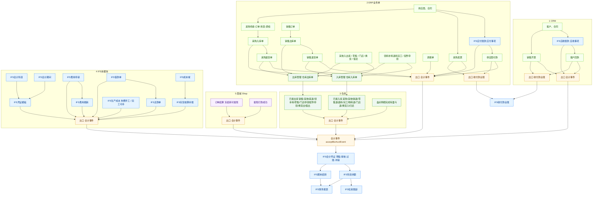

# CRM / ERP / IFS 业财流程图

CRM、ERP 负责业务单据；IFS 负责记账和收付款台账。蓝色是 IFS，橙色是同步入口。

同步分两条，不要混：

1. **会计事件** `acceptBizAcctEvent`：生成会计凭证，过账后进科目余额、报表、账龄。
2. **收付款台账** `addIFsReceivePayment` / `updateReceivePayment`：只进 IFS 收付款列表和开票金额，**不出凭证**。

出入库以**仓库入/出库单审批通过**为准（退货单勾了无需仓库时，业务单自己推）。同一笔货不要同时走「事项确认」和「出入库自动凭证」。

**读图要点**

- 自上而下：CRM / ERP / 仓库 / IFS 本模块 / 商城，各列内部串完，只从橙色「出口」接到会计事件或收付款台账。
- 不再从整框拉线，避免线贴在框边上像连错。
- 采购入库单、销售出库单、零售/门店/换货/借还等，要先转到仓库入/出库单后再记账，对应关系见下面仓库表；调拨单在业务单审批通过后直接推。
- 费用申请、费用报销都推会计事件（申请挂账、报销付现）；加工完工走仓库入库自动推，制费仍手工。
- 商城结算可提现、提现打款成功走 Shop → 会计事件。
- 回款和开票是两条线，不是回款之后才开票。
- 凭证支持冲销：过账后红字冲销，列表可看冲销关系。

## 仓库同步（DepotPut / DepotOut）

菜单：入库管理 `/erp/depotPut`、仓库入库单 `/erp/depotPutList`、出库管理 `/erp/depotOut`、仓库出库单 `/erp/depotOutList`。

| 仓库单 | 来源 fromType | 是否推财务 | eventType |
|--------|----------------|------------|-----------|
| 入库 | 采购入库单 | 是 | `purchaseIn` |
| 入库 | 其他入库单 | 是 | `otherIn` |
| 入库 | 销售退货单 | 是 | `salesReturn` |
| 入库 | 退料入库单 | 是 | `prodReturn` |
| 入库 | 加工入库单 | 是 | `prodFinish`（生产成本自动） |
| 入库 | 零售退货单 | 是 | `retailReturn` |
| 入库 | 物料退货单 | 是 | `materialReturn` |
| 入库 | 门店退货单 | 是 | `storeReturn` |
| 入库 | 门店物料退货单 | 是 | `storeMaterialReturn` |
| 入库 | 销售换货单 | 是 | `exchangeIn` |
| 入库 | 归还入库单 | 是 | `stockReturn` |
| 出库 | 销售出库单 | 是 | `salesOut` |
| 出库 | 其他出库单 | 是 | `otherOut` |
| 出库 | 采购退货单 | 是 | `purchaseReturn` |
| 出库 | 领料出库单 | 是 | `prodPick` |
| 出库 | 补料出库单 | 是 | `prodPick` |
| 出库 | 零售出库单 | 是 | `retailOut` |
| 出库 | 配件申领单 | 是 | `sealPick` |
| 出库 | 门店申领单 | 是 | `storePick` |
| 出库 | 采购换货单 | 是 | `exchangeOut` |
| 出库 | 借出出库单 | 是 | `stockLoan` |
| 盘点 | 盘点明细完成且有盈亏 | 是 | `stocktake` |
| 调拨单 | 调拨审批通过 | 是 | `transfer` |

采购退货/销售退货若 `needDepot=否`，在业务单审批通过时直接推，不再等仓库。

## 已接通的财务同步（审批或完成后）

| 模块 | 功能 | 触发 | 同步到 | 编码 |
|------|------|------|--------|------|
| CRM 应收 | 应收事项 | 审批通过 | 会计事件 | `receivableConfirm` |
| CRM 回款 | 客户回款 | 审批通过 | 会计事件 + 收付款台账新增 | `receipt` |
| CRM 发票 | 销售开票 | 审批通过 | 会计事件 + 台账开票金额回写 | `salesInvoice` |
| ERP 应付 | 应付事项 | 审批通过 | 会计事件 | `payableConfirm` |
| ERP 付款 | 供应商付款 | 审批通过 | 会计事件 + 收付款台账新增 | `payment` |
| ERP 采购发票 | 采购发票 | 审批通过 | 会计事件 + 台账开票金额回写 | `purchaseInvoice` |
| ERP 调拨 | 调拨单 | 审批通过 | 会计事件 | `transfer` |
| ERP 采购退货 | 无需出库 | 退货单审批通过 | 会计事件 | `purchaseReturn` |
| ERP 销售退货 | 无需入库 | 退货单审批通过 | 会计事件 | `salesReturn` |
| IFS 费用 | 费用报销 | 审批通过 | 会计事件 | `expenseReimburse` |
| IFS 费用 | 费用申请 | 审批通过 | 会计事件 | `expenseApply` |
| IFS 借款 | 借款单 | 审批通过 | 会计事件 | `loanBorrow` |
| IFS 还款 | 还款单 | 审批通过 | 会计事件 | `loanRepay` |
| IFS 存货核算 | 补账计价过账 | 手工过账 | 会计事件 勿与仓库重复 | 单上 `billType` |
| IFS 生产成本 | 完工入库 | 加工入库审批自动；手工可补 | 会计事件 | `prodFinish` |
| IFS 生产成本 | 制造费用 | 手工归集入口 | 会计事件 | `mfgOverhead` |
| Shop 结算 | 冻结转可提现 | 结算到期释放 | 会计事件 | `shopSettle` |
| Shop 提现 | 打款成功 | 转账成功回调 | 会计事件 | `shopWithdraw` |
| IFS 会计凭证 | 手工录入 | 保存 | 直接凭证 | `manual` |
| IFS 期末结转 | 损益结转 | 结账 | 会计事件 | `periodClose` |
| IFS 迁移 | 旧报销借款还款 | 迁移接口 | 会计事件 | 对应费用借款还款 |

**默认分录（模板可改，过账后才进账龄）**

| 编码 | 默认分录 | 账龄 |
|------|----------|------|
| `receivableConfirm` | 借 1122 / 贷 6001 | 应收 |
| `salesInvoice` | 无税额不出凭证；有税仅记销项税 | 不重复记应收 |
| `receipt` | 借现金 / 贷 1122 | 冲应收 |
| `payableConfirm` | 借 1405 / 贷 2202 | 应付 |
| `purchaseIn` | 借库存 / 贷 2202 暂估 | 应付 |
| `purchaseInvoice` | 冲暂估、进项税、正式应付 | 影响应付 |
| `purchaseReturn` | 借应付 / 贷库存 | 冲应付 |
| `salesOut` | 借成本 / 贷库存 | 否 |
| `salesReturn` | 借库存 / 贷成本 | 否 |
| `payment` | 借 2202 / 贷现金 | 冲应付 |
| `otherIn` / `otherOut` | 库存 vs 营业外或费用 | 一般否 |
| `prodPick` / `prodReturn` / `prodFinish` | 生产成本与库存 | 否 |
| `stocktake` | 库存 vs 1901 | 否 |
| `expenseReimburse` | 借费用 / 贷现金 | 否 |
| `expenseApply` | 借费用 / 贷 2241 其他应付款 | 否 |
| `retailOut` / `retailReturn` | 成本 vs 库存（同销售出退） | 否 |
| `storePick` / `sealPick` | 借费用 / 贷库存 | 否 |
| `storeReturn` / `storeMaterialReturn` / `materialReturn` | 借库存 / 贷费用或生产成本 | 否 |
| `exchangeOut` | 借应付 / 贷库存 | 冲应付 |
| `exchangeIn` | 借库存 / 贷成本 | 否 |
| `stockLoan` / `stockReturn` | 其他应收 vs 库存 | 否 |
| `shopSettle` | 借费用 / 贷其他应付款 | 否 |
| `shopWithdraw` | 借其他应付款 / 贷现金 | 否 |
| `loanBorrow` / `loanRepay` | 其他应收 vs 现金 | 否 |
| `mfgOverhead` | 借 5001 / 贷 5101 | 否 |
| `transfer` | 借库存(调入仓) / 贷库存(调出仓) | 否 |
| `manual` | 自选 | 1122或2202带辅助则进 |
| `periodClose` | 损益进本年利润 | 否 |

**凭证冲销关系**

会计凭证列表展示「冲销关系」列：冲销凭证显示「冲销：原凭证号」（可点开原凭证）；原凭证被冲销后显示「已被冲销：冲销凭证号」。冲销凭证本身不可再冲销。

**只展示、不同步凭证的 IFS 页**

财务业务流程、凭证上传、资金分析、发票收取/统计/开具（列表看 CRM/ERP 发票）、费用分析、借还统计、奖惩单。

## 联调测试步骤（本批新增）

### 0. 前置（每个环境只做一次）

1. 重启 `skyeye-ifs`、`skyeye-erp`、`skyeye-shop`（及 Cloud_Vue）。
2. IFS → 会计科目 →「初始化默认科目」（补 `2241` 其他应付款）。
3. IFS → 凭证模板 →「初始化默认模板」（补本批新 eventType；已存在的类型会跳过）。
4. 确认当前账套期间已开账；凭证模板对应事项已启用。

### 1. 零售出库 / 零售退货

1. ERP 做零售出库单 → 转仓库出库 → 审批通过。
2. 业财事件台 / 会计凭证：应有 `retailOut`，分录借 6401 / 贷库存，金额=仓库单金额。
3. 做零售退货 → 转仓库入库 → 审批通过 → 凭证 `retailReturn`（借库存 / 贷成本）。

### 2. 门店申领 / 门店退货 / 门店物料退货 / 配件申领 / 物料退货

1. 门店申领 → 仓库出库审批 → `storePick`。
2. 门店退货 → 仓库入库审批 → `storeReturn`。
3. 门店物料退货 → 仓库入库审批 → `storeMaterialReturn`。
4. 配件申领 → 仓库出库审批 → `sealPick`。
5. 物料退货 → 仓库入库审批 → `materialReturn`。

### 3. 换货 / 借还

1. 采购换货 → 仓库出库审批 → `exchangeOut`（借应付 / 贷库存）。
2. 销售换货 → 仓库入库审批 → `exchangeIn`。
3. 借出出库 → 仓库出库审批 → `stockLoan`（借 1221 / 贷库存）。
4. 归还入库 → 仓库入库审批 → `stockReturn`。

### 4. 费用申请

1. IFS 费用申请提交并审批通过。
2. 凭证 `expenseApply`：借管理费用 / 贷其他应付款 2241；来源类型 `IFS_FEE_APPLICATION`。

### 5. 生产成本

1. 加工入库 → 仓库入库审批 → 自动 `prodFinish`（无需再点手工完工，除非补账）。
2. 制造费用仍走 IFS「生产成本/制费」手工入口 → `mfgOverhead`。

### 6. 商城结算 / 提现

1. 个人店订单确认收货并过结算冻结期（或走定时/强制释放）→ 流水「结算可提现」后，IFS 有 `shopSettle`（金额=分转元）。
2. 提现申请审核通过且渠道打款成功 → `shopWithdraw`（借其他应付款 / 贷银行存款）。
3. Shop 需配置 `webroot.skyeye-ifs`，且能访问 ifs 服务。

### 7. 凭证冲销关系 UI

1. 任选一张已过账非冲销凭证 → 冲销。
2. 列表：原凭证状态作废，冲销关系「已被冲销：xxx」；新凭证冲销关系「冲销：原凭证号」，点击可打开原凭证。
3. 冲销凭证行不应再出现「冲销」按钮。
