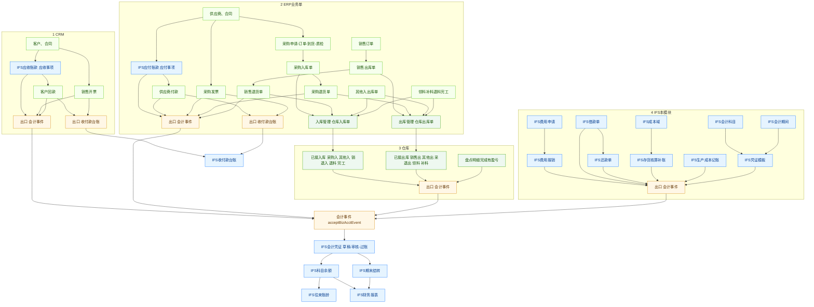

# CRM / ERP / IFS 业财流程图

CRM、ERP 负责业务单据；IFS 负责记账和收付款台账。蓝色是 IFS，橙色是同步入口。

同步分两条，不要混：

1. **会计事件** `acceptBizAcctEvent`：生成会计凭证，过账后进科目余额、报表、账龄。
2. **收付款台账** `addIFsReceivePayment` / `updateReceivePayment`：只进 IFS 收付款列表和开票金额，**不出凭证**。

出入库以**仓库入/出库单审批通过**为准（退货单勾了无需仓库时，业务单自己推）。同一笔货不要同时走「事项确认」和「出入库自动凭证」。

**读图要点**

- 自上而下：CRM / ERP / 仓库 / IFS 本模块，各列内部串完，只从橙色「出口」接到会计事件或收付款台账。
- 不再从整框拉线，避免线贴在框边上像连错。
- 采购入库单、销售出库单等业务单，要先转到仓库入/出库单后再记账，对应关系见下面仓库表。
- 回款和开票是两条线，不是回款之后才开票。

## 仓库同步（DepotPut / DepotOut）

菜单：入库管理 `/erp/depotPut`、仓库入库单 `/erp/depotPutList`、出库管理 `/erp/depotOut`、仓库出库单 `/erp/depotOutList`。

| 仓库单 | 来源 fromType | 是否推财务 | eventType |
|--------|----------------|------------|-----------|
| 入库 | 采购入库单 | 是 | `purchaseIn` |
| 入库 | 其他入库单 | 是 | `otherIn` |
| 入库 | 销售退货单 | 是 | `salesReturn` |
| 入库 | 退料入库单 | 是 | `prodReturn` |
| 入库 | 加工入库单 | 是 | `prodFinish` |
| 入库 | 零售退货单 | 否 | |
| 入库 | 物料退货单 | 否 | |
| 入库 | 门店退货、门店物料退货 | 否 | |
| 入库 | 销售换货单 | 否 | |
| 入库 | 归还入库单 | 否 | |
| 出库 | 销售出库单 | 是 | `salesOut` |
| 出库 | 其他出库单 | 是 | `otherOut` |
| 出库 | 采购退货单 | 是 | `purchaseReturn` |
| 出库 | 领料出库单 | 是 | `prodPick` |
| 出库 | 补料出库单 | 是 | `prodPick` |
| 出库 | 零售出库单 | 否 | |
| 出库 | 配件申领单 | 否 | |
| 出库 | 门店申领单 | 否 | |
| 出库 | 采购换货单 | 否 | |
| 出库 | 借出出库单 | 否 | |
| 盘点 | 盘点明细完成且有盈亏 | 是 | `stocktake` |
| 调拨单 | 调拨审批通过 | 是 | `transfer` |

采购退货/销售退货若 `needDepot=否`，在业务单审批通过时直接推，不再等仓库。

## 已接通的财务同步（审批或完成后）

| 模块 | 功能 | 触发 | 同步到 | 编码 |
|------|------|------|--------|------|
| CRM 应收 | 应收事项 | 审批通过 | 会计事件 | `receivableConfirm` |
| CRM 回款 | 客户回款 | 审批通过 | 会计事件 + 收付款台账新增 | `receipt` |
| CRM 发票 | 销售开票 | 审批通过 | 会计事件 + 台账开票金额回写 | `salesInvoice` |
| ERP 应付 | 应付事项 | 审批通过 | 会计事件 | `payableConfirm` |
| ERP 付款 | 供应商付款 | 审批通过 | 会计事件 + 收付款台账新增 | `payment` |
| ERP 采购发票 | 采购发票 | 审批通过 | 会计事件 + 台账开票金额回写 | `purchaseInvoice` |
| ERP 调拨 | 调拨单 | 审批通过 | 会计事件 | `transfer` |
| ERP 采购退货 | 无需出库 | 退货单审批通过 | 会计事件 | `purchaseReturn` |
| ERP 销售退货 | 无需入库 | 退货单审批通过 | 会计事件 | `salesReturn` |
| IFS 费用 | 费用报销 | 审批通过 | 会计事件 | `expenseReimburse` |
| IFS 借款 | 借款单 | 审批通过 | 会计事件 | `loanBorrow` |
| IFS 还款 | 还款单 | 审批通过 | 会计事件 | `loanRepay` |
| IFS 存货核算 | 补账计价过账 | 手工过账 | 会计事件 勿与仓库重复 | 单上 `billType` |
| IFS 生产成本 | 完工或制费 | 手工入口 | 会计事件 | `prodFinish` / `mfgOverhead` |
| IFS 会计凭证 | 手工录入 | 保存 | 直接凭证 | `manual` |
| IFS 期末结转 | 损益结转 | 结账 | 会计事件 | `periodClose` |
| IFS 迁移 | 旧报销借款还款 | 迁移接口 | 会计事件 | 对应费用借款还款 |

**默认分录（模板可改，过账后才进账龄）**

| 编码 | 默认分录 | 账龄 |
|------|----------|------|
| `receivableConfirm` | 借 1122 / 贷 6001 | 应收 |
| `salesInvoice` | 无税额不出凭证；有税仅记销项税 | 不重复记应收 |
| `receipt` | 借现金 / 贷 1122 | 冲应收 |
| `payableConfirm` | 借 1405 / 贷 2202 | 应付 |
| `purchaseIn` | 借库存 / 贷 2202 暂估 | 应付 |
| `purchaseInvoice` | 冲暂估、进项税、正式应付 | 影响应付 |
| `purchaseReturn` | 借应付 / 贷库存 | 冲应付 |
| `salesOut` | 借成本 / 贷库存 | 否 |
| `salesReturn` | 借库存 / 贷成本 | 否 |
| `payment` | 借 2202 / 贷现金 | 冲应付 |
| `otherIn` / `otherOut` | 库存 vs 营业外或费用 | 一般否 |
| `prodPick` / `prodReturn` / `prodFinish` | 生产成本与库存 | 否 |
| `stocktake` | 库存 vs 1901 | 否 |
| `expenseReimburse` | 借费用 / 贷现金 | 否 |
| `loanBorrow` / `loanRepay` | 其他应收 vs 现金 | 否 |
| `mfgOverhead` | 借 5001 / 贷 5101 | 否 |
| `transfer` | 借库存(调入仓) / 贷库存(调出仓) | 否 |
| `manual` | 自选 | 1122或2202带辅助则进 |
| `periodClose` | 损益进本年利润 | 否 |

**有枚举但仓库未推财务（不要当成已同步）**

- 零售出库 / 零售退货
- 门店申领 / 门店退货 / 门店物料退货
- 销售换货入库 / 采购换货出库
- 借出出库 / 归还入库
- 物料退货入库、配件申领出库
- 商城订单/结算（Shop 未接 IFS 会计事件）

**只展示、不同步凭证的 IFS 页**

财务业务流程、凭证上传、资金分析、发票收取/统计/开具（列表看 CRM/ERP 发票）、费用分析、借还统计、奖惩单。
